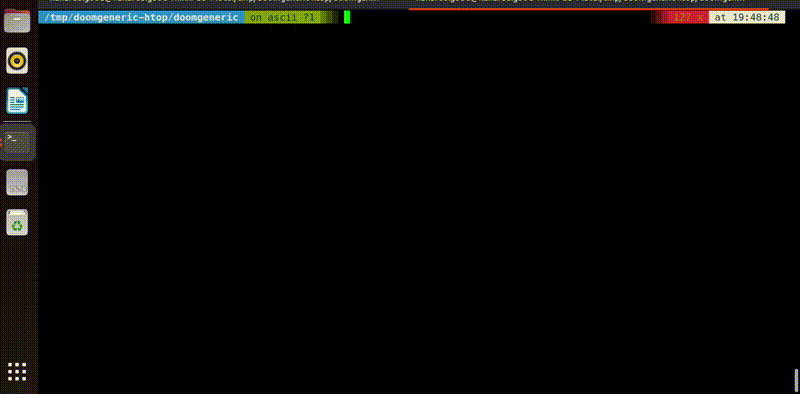

# doom-htop
Ever wondered whether `htop` could be used to render the graphics of cult video games? I know I have.
In order to quench our curiosity and for your viewing pleasure, I created `doom-htop`.



# Table of Contents
1. [How to build](#How-to-build)
2. [How to run](#How-to-run)
3. [How it works](#How-it-works)
4. [Platforms](#Platforms)
5. [Troubleshooting](#Troubleshooting)
6. [Further work required](#further-work-required)
7. [F.A.Q](#faq)
8. [License](#License)

## How to build
```
cd doomgeneric
make -j8
```

**Notice!** In order to use this project, you need a WAD (game data) file. The one I included is freedoom1.wad (All credit goes to [The Freedoom project](https://freedoom.github.io/index.html)!).

Of course you're welcome to download the classic free shareware version DOOM1.wad [from here](https://doomwiki.org/wiki/DOOM1.WAD). (I wasn't sure if I was legally allowed to upload it to github, and decided against it).

## How to run
If I were you, I would probably save any important work I have open before doing this. That being said, I tested this code on a 12-year old Lenovo® ThinkPad T430s with 8GB RAM and an Intel Core i7-3520M @ 2.90GHz running Ubuntu 22.04 and it ran just fine.

Anyways, simply run:
```
sed -i 's/update_process_names=0/update_process_names=1/' ~/.config/htop/htoprc
sudo ./doom-htop -iwad freedoom1.wad
htop -d 1 -s M_VIRT
```
It doesn't matter whether you run `doom-htop` or `htop` first.

The `sudo` is only needed in order to open your keyboard's device.

If you're the kinda person who would rather not run sketchy programs off the *Internet™* with root privilges, you can go ahead and run it without `sudo` and just look at the pretty pictures.

The `-d 1` is because we're going for that sweet, sweet 10 FPS refresh rate, and the `-s M_VIRT` is because we're gonna want to sort the processes by virtual memory allocation, which should be pretty indicative of our processes and bunch them up together nicely. If for some reason that doesn't work for you, you can go ahead and play with the define `PROCS_MALLOC_SIZE` in `main.c` until everything looks nice.

Finally, the `sed` command is needed because by default, `htop` doesn't refresh the processes' names every time.
This design choice was *probably* made because `htop` wasn't originally designed to render ascii-art videos, but we'll never know for sure.

## How it works

It's pretty straight-forward, actually. The amazing project https://github.com/ozkl/doomgeneric which I forked, did all the heavy lifting.
I simply added the 3 files:
1. main.c
2. keylogger.c
3. ascii_stuff.c

And edited a few others.

I wrote a simple image-to-ascii converter that generated the long if statement you can find in the file `ascii_stuff.c`.

The main doom process forks and creates as many process as there are lines in the ascii converted image, and then creates a shared memory segment with every single one of them.

The main process copies each line in the image to the matching process's memory segment, and each child-process copies from its segment and writes over its `argv[0]`. That's it, really.

Originally I wanted to do it with processes sorted by CPU usage, and create a process that consumes a specific CPU percentage, but that turned out to be pretty hard.
Then I though about using linux's `nice`, but as a user you're only allowed 19 possible values, and I wanted better graphics. Eventually I stumbled upon the idea of using virtual memory allocation, which as I said before, as pretty specific per process.

I noticed that even when all the forked processes allocate exactly the same amount of memory, `htop` shows the frame in the right order. I believe that happens because maybe in case of equality the processes are then sorted by time of creation? This works on my system (and is actually a little better, because that way there is less space in which another process could "get into the frame"), but I wasn't sure how it would work on other people's systems and didn't want to take the chance. This also means that I could have probably just given all the processes a unique `nice` value, but whatever.

Anyways, then I created a simple keylogger that works by opening the keyboard's device. This way the game is always playing in the background regardless of whether `htop` is open or not, which I think is neat.


## Platforms
I only ever tested it on my Ubuntu 22.04. I know the keyboard device is named something else in WSL and Arch, you're welcome to port it if you like.

## Troubleshooting
1. **Keyboard doesn't work**
    
    The device I'm trying to open is defined in `#define KEYBOARD_DEVICE` in the file `main.c`. I'm sure it won't work universally. I only tested the code on Ubuntu 22.04, and I know for a fact it won't work out of the box for WSL, and that the device in Arch is named something else. You're welcome to port it to your platform.
Try to `ll /dev/input/by-path`, and choose one of the options that has `kbd` in it.
2. **The frame is frozen**

    Maybe the `sed` command didn't work. You can change the `htop` configuation manually by hitting the F2 key -> "Display options" -> mark `[X]` on "Update process names on every refresh"
3. `sed: can't read /home/<user>/.config/htop/htoprc: No such file or directory`

    I guess this will probably happen if you've never used `htop` before. In that case run `htop`, quit, and run the `sed` command again.
4. For some reason the main doom process crashed, and you're left with a ton of zombie processes doing nothing:
Run `sudo pkill doom-htop`.

## Further work required
* `htop` moves the screen around when you're trying to walk around using the arrow keys which is pretty annoying. A simple but silly solution would be to change `htop`'s focus after you start your game, for example by pressing `a`, which opens the menu for selecting your processors, then it won't be as annoying.

## F.A.Q 
1. Q: Why did you make this? A: I thought it would be [funny](https://github.com/xoreaxeaxeax/movfuscator?tab=readme-ov-file#faq).

## License
Freedoom is released under a BSD-like license which can be found in the file freedoom-license.txt in the main directory. I believe all other code is GPL'd.